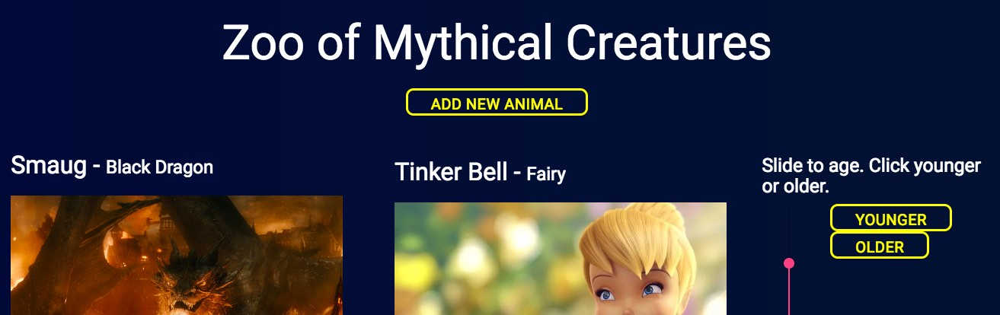
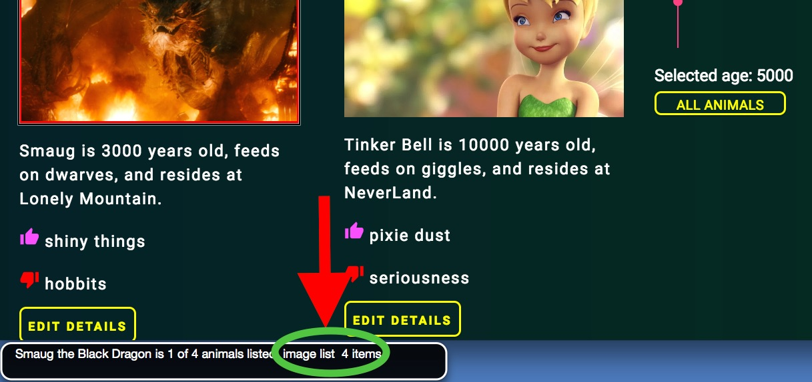

This is an Angular 2 (no CLI) web application for Epicodus code school Friday assignment.  

It is built with ARIA - ["Web Accessibility Initiative – Accessible Rich Internet Applications"](https://www.w3.org/TR/wai-aria/) - as a foundational principle. This is my first conscious attempt to include ARIA into a web application.


##### In order to test ARIA, please use a screen reader to checkout the application. I used VoiceOver on Mac for testing purposes.

```
While in your browser, start up VoiceOver with Command+F5 on Mac
```

As you tab through to navigate the page with your keyboard, you will reach an animal image.



* The audio will describe total animals displayed, depending on filter results.

* To explore the "image list 4 items", use the following keyboard command.

```
CTRL+Option+ Right Arrow
```


As a user of this Zoo App

* I want to log a newly-admitted animal by submitting a form with animal species, name, age, diet, zoo location, number of needed caretakers, sex, one like and one dislike.

* I want to view a list of animals I have logged.

* I want options to view all animals, filter animals for younger or older based on any age choice.

* I want to click an animal to edit its name, age or caretakers.

## Planning

### 1. Outline behaviors in README.

### 2. Study ARIA.

*  VoiceReader will usually refer to aria-label for audio output. [Examples of aria-label vs aria-labelledby vs aria-describedby](http://www.maxability.co.in/2013/01/aria-label-labelledby-describedby/)


*  Include role="button" on non-button elements acting like buttons.

*  Setting focus on tabbed to elements. [Good reference here using a simple CSS trick/](https://css-tricks.com/almanac/selectors/f/focus/)  

* To globally change what focus looks like, :focus {/* add your css code here*/}

### 3. Design Considerations

According to the [American Foundation For the Blind](https://afb.org), font size should be at least 16, Sans Serifs, bolder and thicker font styles.

Also, lighter colors for descriptive elements against a darker background is better.

Line spacing should be at least 1.5

### 4. Components

FilteredAnimals

FilterTool

Add New Animal

Edit Current Animal


### 5. Specs


| Behavior | Input Example| Output Example    |
| ---------| -----------------|-----------------|
|create a new Animal Object|new Animal(params)| Animal |

# Technologies

Angular 2, TypeScript, JavaScript, Jquery, HTML5, CSS
[Angular Material](https://material.angular.io/) and [Materialize](http://materializecss.com/) for front-end css frameworks.

## Prerequisites

You will need the following software properly installed on your computer.

* [Git](https://git-scm.com/)
* [Node.js](https://nodejs.org/) (with NPM)
* [Bower](https://bower.io/)


## Installation

Perform the following  steps at your terminal prompt

* #### Enter the following to download the app files.
```
git clone https://github.com/XiXiaPdx/zoo-angular.git
```
*  #### get into the app folder
```
cd ng-zoo
```
*  #### install node dependencies
```
npm install
```
* #### install bower dependencies
```
bower install
```
* #### gulp build
```
gulp build
```
* #### gulp serve
```
gulp serve
```

## Further Exploration

The code isn't efficient. The filtering mechanism runs extra loops that are not necessary.

## License

Copyright (c) 2017 Xi Xia. This software is licensed under the MIT license.
